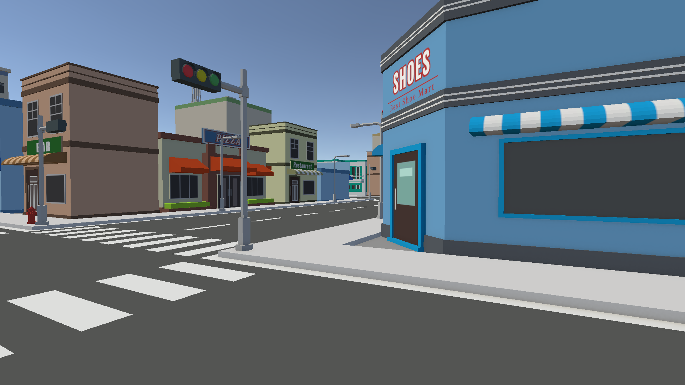

# In The End: Parking Simulator


**In The End: Parking Simulator** adalah game simulasi parkir 3D yang menguji kemampuan pemain dalam mengendalikan kendaraan untuk parkir di area yang ditentukan dengan presisi tinggi. Terinspirasi dari game **Dr. Driving** (2013).



## Fitur Utama

- **Fisika Kendaraan** - Kontrol mobil menggunakan WheelCollider untuk pengalaman mengemudi yang realistis
- **2 Level** - Level 1 (Parkir Statis) dan Level 2 (Parkir Dinamis dengan AI Traffic)
- **Sistem Kesehatan** - 3 HP dengan indicator hati di HUD
- **Minimap** - Peta kecil dengan indikator posisi pemain dan zona parkir
- **Parking Timer** - Mobil harus tetap diam selama 3 detik di zona parkir
- **AI Traffic** - Mobil bot yang bergerak mengikuti waypoint di Level 2
- **Environmental Details** - Traffic light, street light, lampu bangunan, police siren, helicopter

## Kontrol

| Tombol | Aksi |
|--------|------|
| W / ↑ | Akselerasi Maju |
| S / ↓ | Akselerasi Mundur |
| A / ← | Belok Kiri |
| D / → | Belok Kanan |
| Space | Rem |
| H | Klakson |
| Q | Lampu Sein Kiri |
| E | Lampu Sein Kanan |

## Level

### Level 1 - Static Parking
Parkir mobil di ParkingZone tanpa menabrak obstacle statis (pohon, bangunan, tiang lampu, hydrant, billboard, dll).

### Level 2 - Dynamic Parking
Sama seperti Level 1, ditambah mobil bot yang bergerak dinamis sebagai tantangan tambahan.

## Spesifikasi Teknis

| Komponen | Detail |
|----------|--------|
| Game Engine | Unity 6000.3.12f1 |
| Bahasa | C# |
| Render Pipeline | Universal Render Pipeline (URP) 17.3.0 |
| Input System | Unity Input System 1.19.0 |
| Camera | Cinemachine 3.1.6 |
| Physics | Unity Physics (Rigidbody + WheelCollider) |
| UI | TextMesh Pro 2.0.0 |
| Target Platform | PC (Windows) |

## Struktur Folder

```
Assets/
├── Scripts/          # 18 script C# (CarController, GameManager, ParkingZone, dll)
├── Scenes/           # MainMenu, Level 1, Level 2
├── Prefabs/          # Prefab kendaraan player
├── UI/               # Asset HUD (heart icon, minimap)
├── Materials/        # Material termasuk ParkingZone indicator
├── Audio/            # Efek suara (klakson, dll)
├── Docs/             # Game Design Document
└── Screenshots/      # Screenshot game
```

## Cara Menjalankan

1. Clone repository ini
2. Buka project di Unity 6000.3.12f1 atau lebih baru
3. Buka scene `Assets/Scenes/MainMenu.unity`
4. Tekan **Play** untuk memulai game

## Dokumentasi

Lihat [Game Design Document](Assets/Docs/GDD%20-%20In%20The%20End%20Parking%20Simulator.md) untuk detail lengkap mengenai desain game.

## Developer

**Ahmad Saifi Khayatu Ulumuddin** - Game Designer, Artist, Programmer, Sound Engineer, Producer

## Referensi

- [Dr. Driving (2013)](https://play.google.com/store/apps/details?id=com.Sinyour.DrDriving) - Inspirasi utama mekanik parkir
